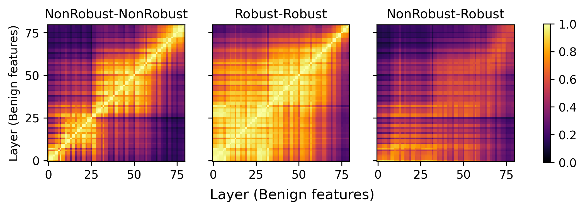

# Understanding Robust Learning through the Lens of Representation Similarities

Code for our recent work where we aim to better understand the internal representations of robust neural networks. Robust networks, which are trained to defend against adversarial inputs, exhibit strikingly different fundamental characteristics (such as poor generalization, overfitting, etc.) than non-robust networks. Using representation similarity metrics, mainly centered kernel alignment ([CKA](https://arxiv.org/abs/1905.00414)), we examine how internal representations in robust networks fundamentally differs from non-robust ones. 


## Getting started

Let's start by installing all dependencies. `pip install -r requirements.txt`

## Usage
We provide checkpoints of pre-trained networks (CIFAR-10) in `./pretrained/` dir for the purpose of following demo. 

Let's start with analyzing the cross-layer similarity (CKA) for a *non-robust* network. For a non-robust network, a block-structure emerges, showing that neighboring layers tend to learn similar representations. 

`CUDA_VISIBLE_DEVICES=0 python cka.py --model wrn_28_4 --dataset cifar10 --model0_layers all --model1_layers all --model_path ./pretrained/cifar10_wrn_28_4_nonrobust_last.pth.tar --savedir ./results`

Now let's do the similar experiment with a robust network. All we need to do is change the checkpoint path. 

`CUDA_VISIBLE_DEVICES=0 python cka.py --model wrn_28_4 --dataset cifar10 --model0_layers all --model1_layers all --model_path ./pretrained/cifar10_wrn_28_4_robust_linf_last.pth.tar --savedir ./results --suffix adv_model`

We can also measure the similarity of representations between robust and non-robust network (again by simply changing the checkpoints). Note that we are using benign representations so far. To use the adversarial representations simply switch the `--adv` flag to 1. 

`CUDA_VISIBLE_DEVICES=0 python cka.py --model wrn_28_4 --dataset cifar10 --model0_layers all --model1_layers all --model_path ./pretrained/cifar10_wrn_28_4_nonrobust_last.pth.tar ./pretrained/cifar10_wrn_28_4_robust_linf_last.pth.tar --savedir ./results --suffix cross_model`

**Plot results:** We can analyze the CKA results using the custom plotting function. 

`python utils/plots.py`

Which will generate the following plot that displays results from all three aforementioned analyses.


## Custom usage
To adapt to your use case, first add your model to existing models (if it's not already available) and provide the checkpoint through command line flags. Once can easily download checkpoints of most robust models using [RobustBench](https://robustbench.github.io/). This might be the only change you will need to make to start analyzing CKA on your models.

## Reference
If you find this work helpful, consider citing it. 

```bibtex
@inproceedings{cianfarani2022RobustRS,
    title={Understanding Robust Learning through the Lens of Representation Similarities},
    author={Christian Cianfarani and Arjun Nitin Bhagoji and Vikash Sehwag and Ben Zhao and Prateek Mittal},
    booktitle={Arxiv},
    year={2022}
}
```
